Title: Necromancer
Date: 2016-07-14 09:00
Category: VulnHub CTF

**This is a Necromancer challenge from vulnhub.com. You can obtain the virtual
machine from: [here](https://www.vulnhub.com/entry/the-necromancer-1,154/)**

***Day1***
==========

We found our target with:

```
netdiscover -r 10.0.0.1/24
```

As usual scan the target:

```
nmap -sS -T5 -Pn -n 10.0.0.137
```
Didn't find anything so lets look for all ports:
```
nmap -sS -T5 -Pn -n -p- 10.0.0.137
```
There is no open TCP ports on the target. So let's look to the udp:
```
nmap -sU -T5 -Pn -n -p- 10.0.0.137
```
Only single 666(doom) Udp port open...

So i try to connect to port 666 with ncat with no result... At this point i
stuck a little bit :) but finally decide to listen for trafic from the target.
Fire up wireshark and start sniffing. Found this interesting packets:
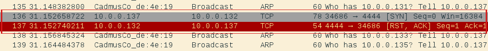

Lets catch incoming connection with ncat and see what will happen:
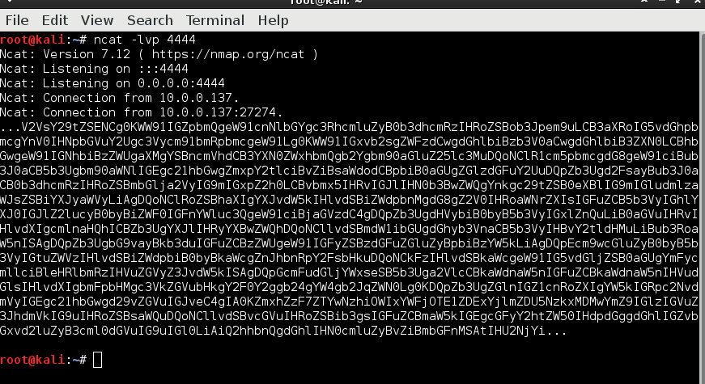

Got some jiberish string... I paste it in my Owasp Zap and able to decode it as
base 64:
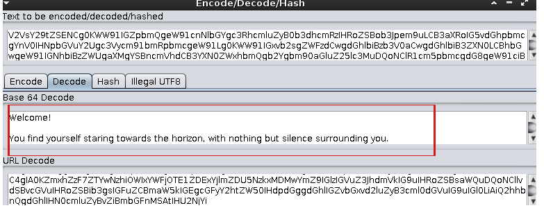

The full text is bellow:
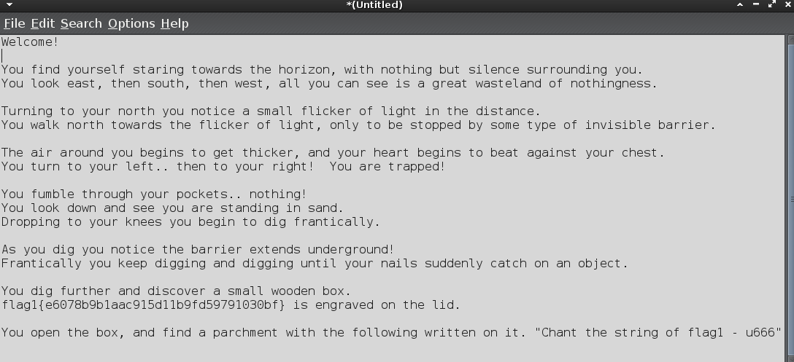
It's talk about send some string to the 666udp. After a while i ended up send
decoded **flag1{e6078b9b1aac915d11b9fd59791030bf}:(opensesame)** to the Udp 666 on the target:
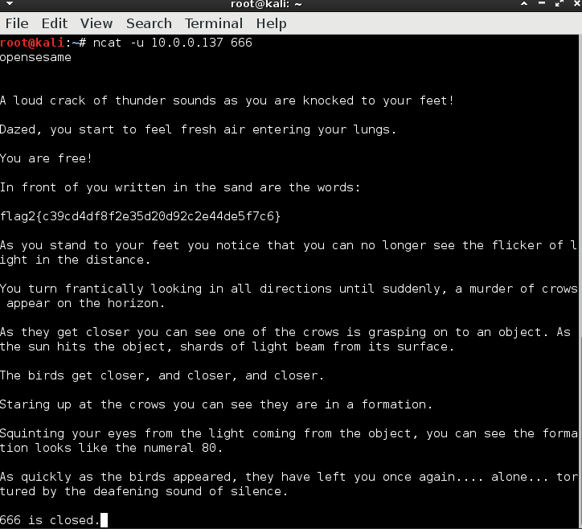

This is give as **flag2{c39cd4df8f2e35d20d92c2e44de5f7c6}** and said something about close 666 and open 80. So nmap
confirm port 80 on the target is open it's time to browse the site.
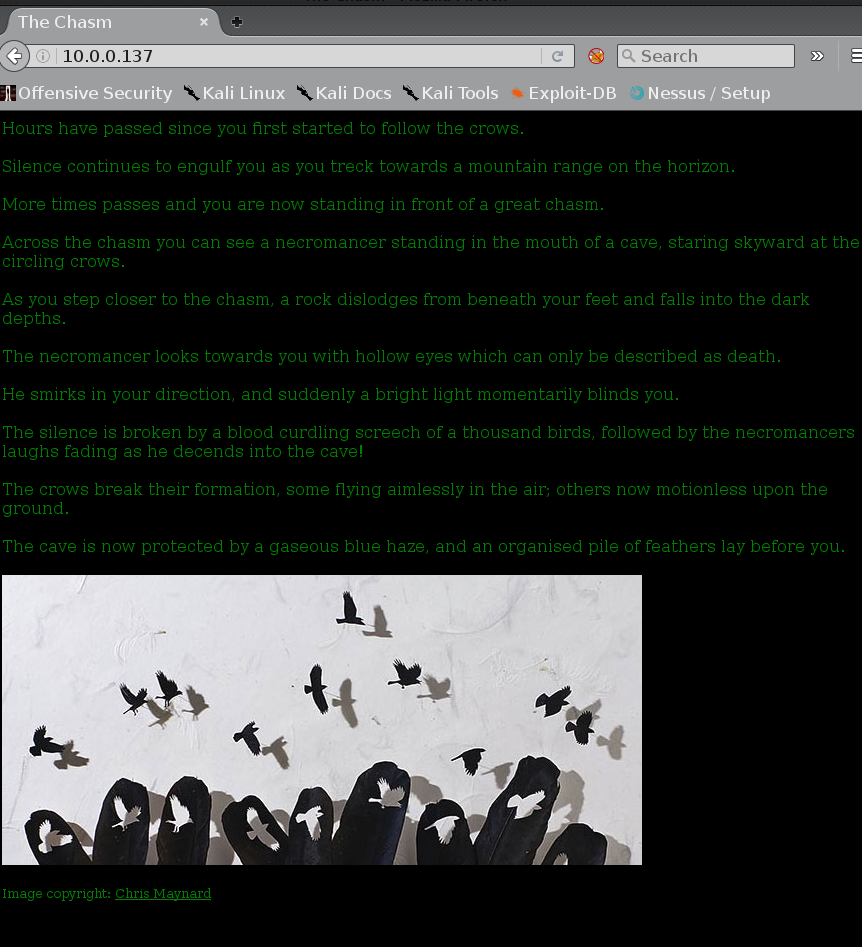
I scan with nikto, looking around with firebug and found nothing interesting. It
should be something about the picture so i download it and look carefully on it.
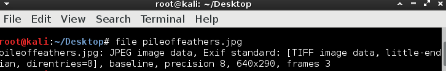

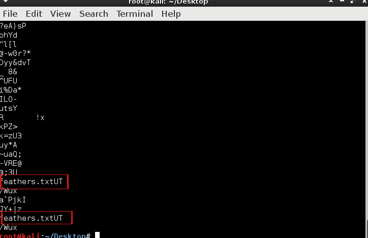

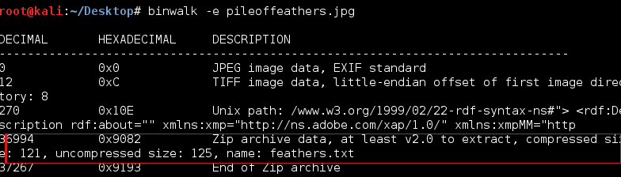
Looks like there is zip archive in the picture so after unzip the pic we recived
feathers.txt contained base64 string. Decide to use my universal Zap to decode
it and there is flag number 3 and some directory:
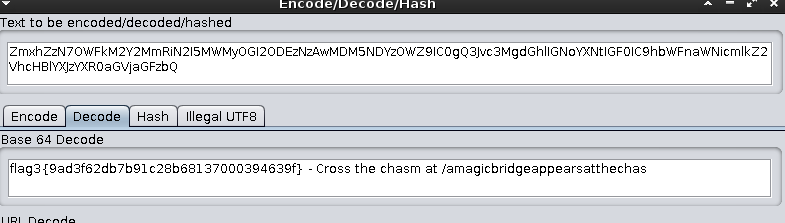
We found **flag3{9ad3f62db7b91c28b68137000394639f}** and dir **/amagicbridgeappearsatthechasm**

I explore the recently founded directory, there is a second picture. I examine
this picture for a long time but unable to find anything in it. At this point i
stuck big time! Run a lot of scans and fuzzers but unable to find anything. So i
was force to look of walkthrough of someone to get some type of joker. Quikly i 
see other dudes able to find talisman file after fuzzed the target. That's 
strange because I run dirbuster with alot of dictonaries, but that didn't work 
for me. Look like dirbuster didn't work. So after I already know what to look 
for I quickly switch to wfuzz using same dictonary as in dirbuster but wfuzz
found what I searched:
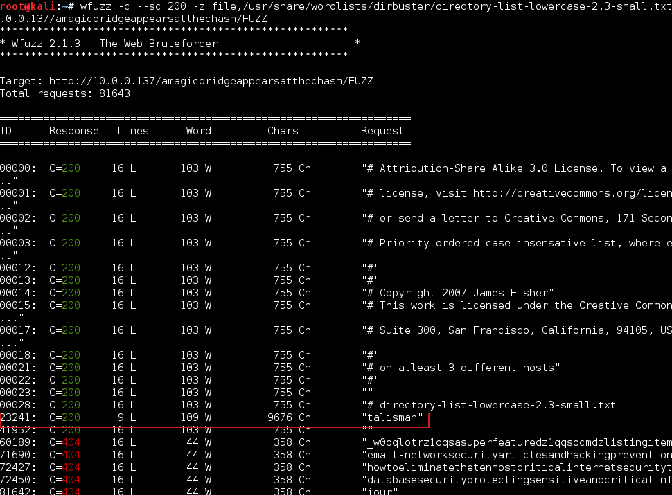
We found talisman :) At first it's look like binary file. Stucked again! So i
decide to go to sleep and fight tomorrow witch a fresh head.

***Day2***
==========

So after I sllep for a while I start fighting again on the next day with fresh 
head. After half a day I'm ready to post how i got flag 4:
This is the properties of talisman file:

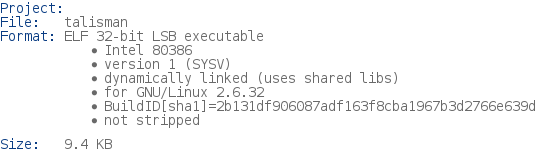

To open the file on my attacking machine:
```
apt-get install lib32z1
```
 so i can run this 32bit binary.

After I left no stone unturned found this interesting functions in the file:
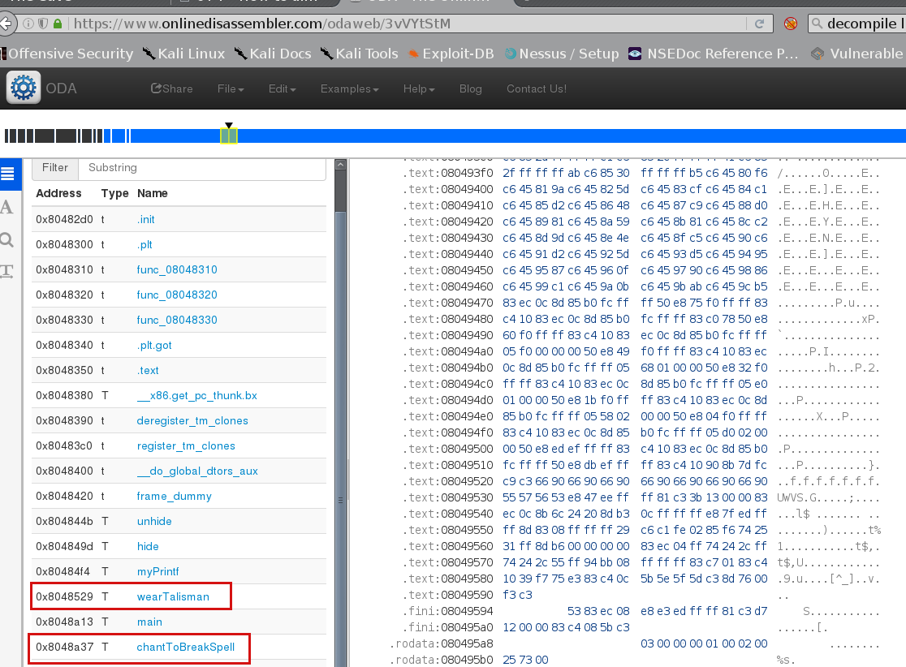
Next i learn how to use gdb, i guess that's going to be useful in the future :)
Confirm the file contains this two functions:
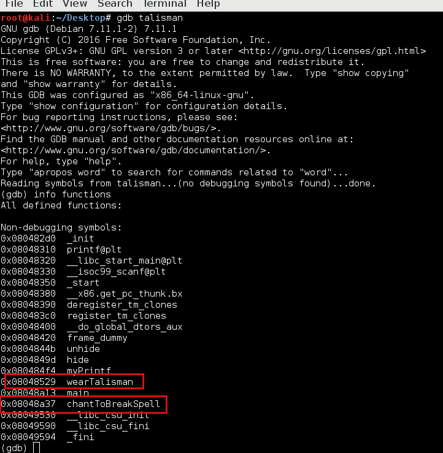
Hithing the chantToBreakSpell function with the debugger:
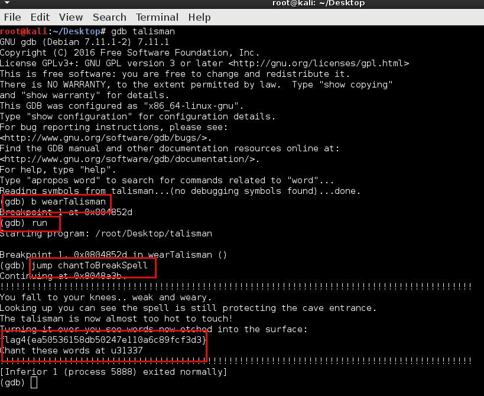
**flag4{ea50536158db50247e110a6c89fcf3d3}:blackmagic**
With the flag4 we recieved instructions to send the decrypted flag4 to udp 
31337:
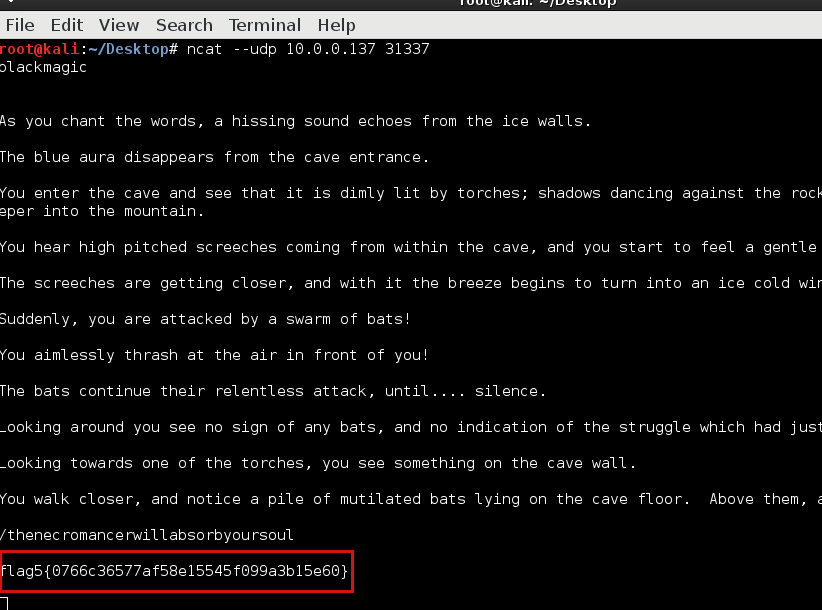
We found **flag5{0766c36577af58e15545f099a3b15e60}:809472671** and directory
/thenecromancerwillabsorbyoursoul let's visit it:
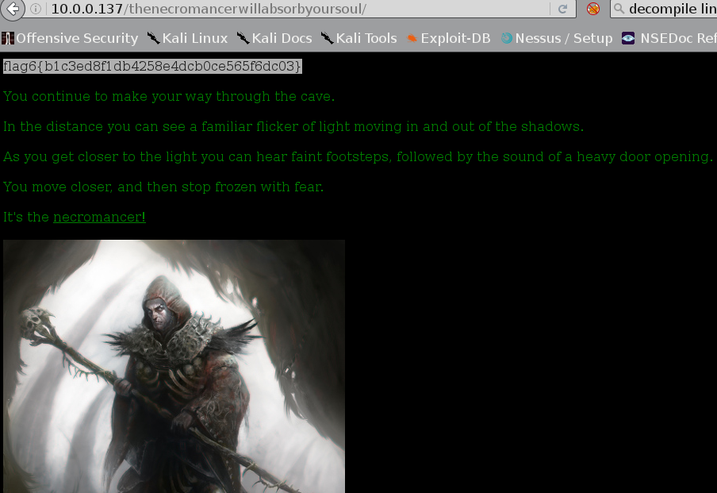
In the /thenecromancerwillabsorbyoursoul at the top of the page just like that
we found  **flag6{b1c3ed8f1db4258e4dcb0ce565f6dc03}:1756462165**.And necromancer file. It's bzip2 file, after unzip it we ended up with pcap
file. I look at the file with wireshark it's look like contains some type of
wireless traffic. Look at the file for more than a hour and finally decide to take
break and continue tomorrow. So this is the end of day two. I learned alot about
how to decompile and debug binary files. I guess tomorrow will learn alot about
wireless traffic :).

***Day3***
==========
After a couple of days I'm back. Ready to bang my hand against the wall untill I
died.

***Day4***
==========
It's look like i died in day3 so back again... One more day wasted of my life.
This is what i found in the pcap file:

Wireless access point with ssid community:
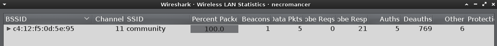

Also found this handshake in the file:
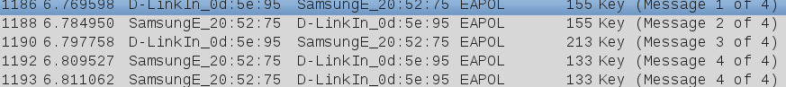

Decrypt the handshake with aircrack-ng
```
  aircrack-ng -w rockyou.txt necromancer.cap
```
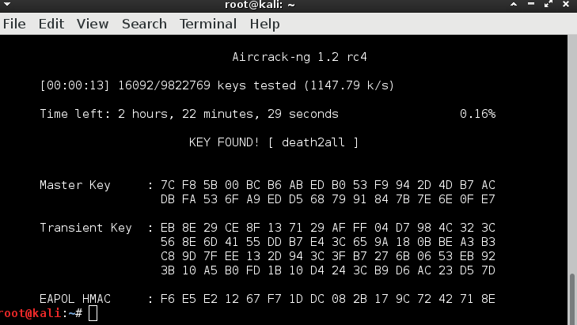

In the last web page we saw something about port 161:
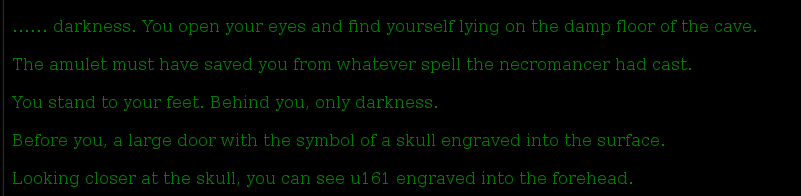

Snmp-enum port 161 with metasploit:
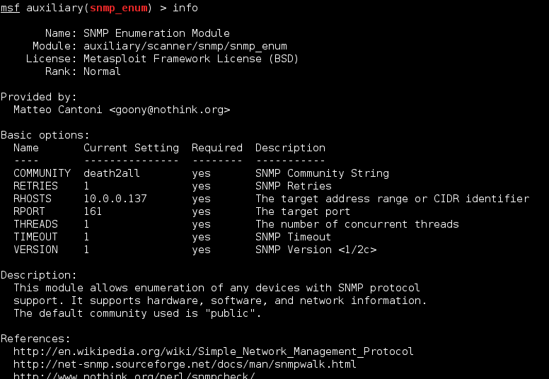

This is the result from snmp-enum module:
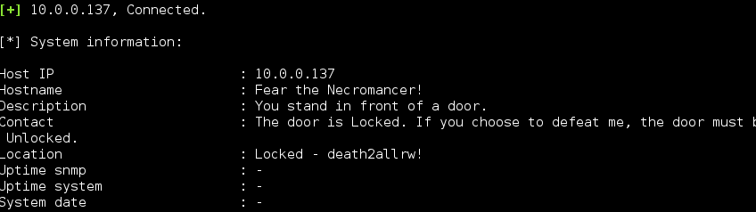

It's told as to unlock the door, so this is what I ended with:
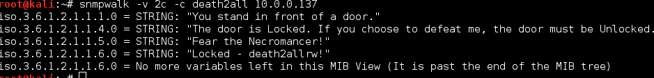
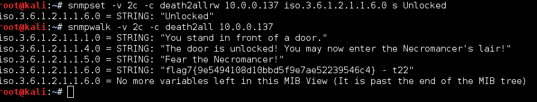
**flag7{9e5494108d10bbd5f9e7ae52239546c4}:demonslayer** found! Finally!

Now we focus on port 22 ssh, and realize that demonslayer is the user not the
password:
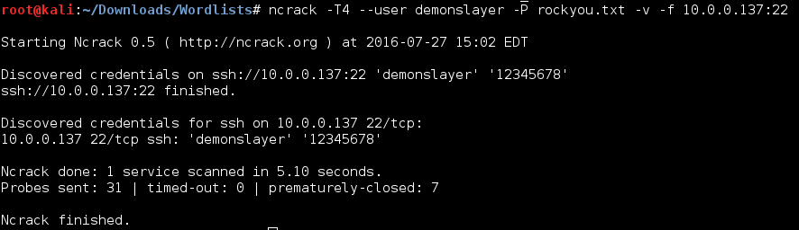

The credentials to ssh on the target are: demonslayer:12345678
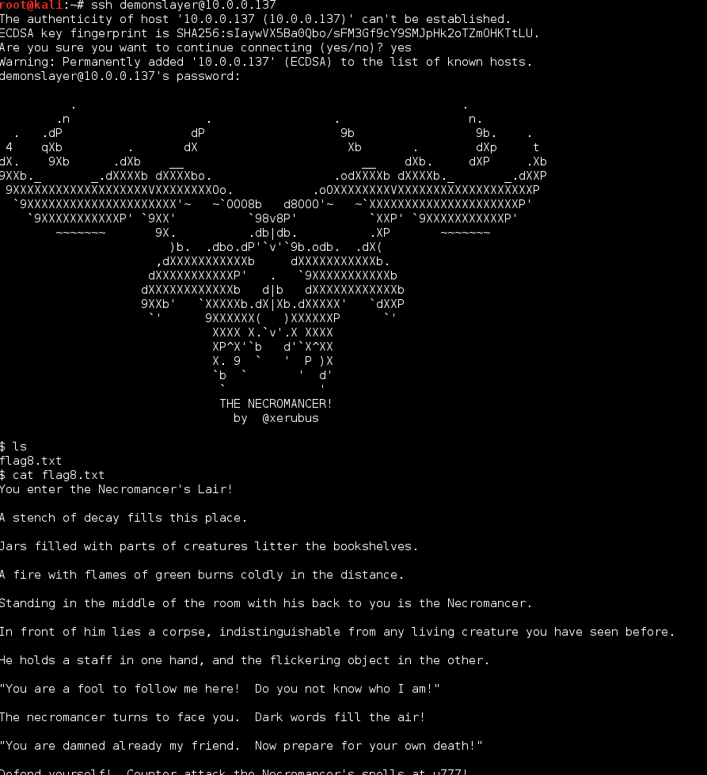
So at the bottom the silly history redirect as to udp 777. We connect to it from
the target and enter even silly trivia with three hitpoints for every question. 
(Things get really annoying there, founded the answers with google):
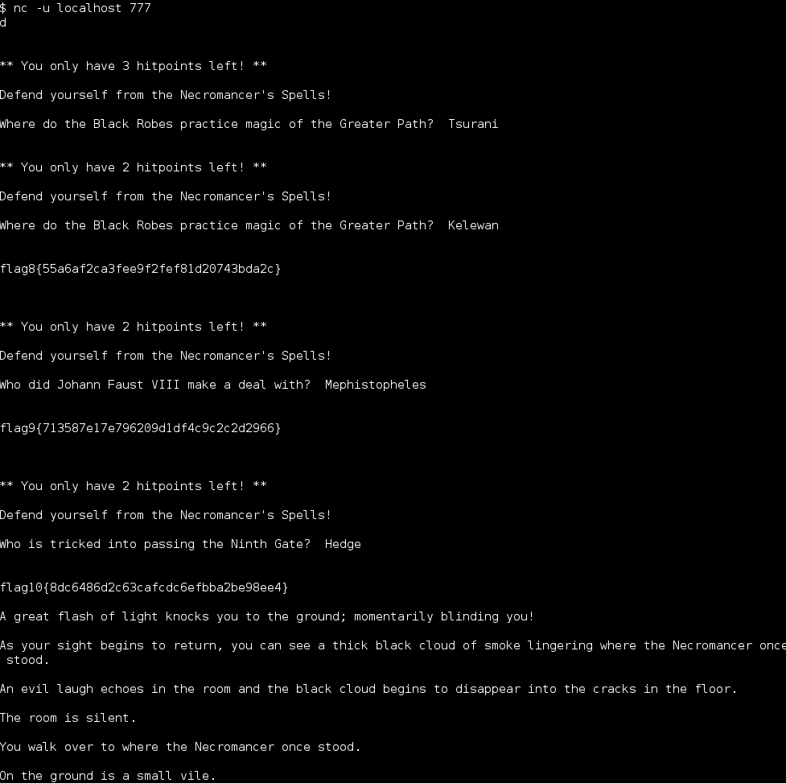

**flag8{55a6af2ca3fee9f2fef81d20743bda2c}**

**flag9{713587e17e796209d1df4c9c2c2d2966}**

**flag10{8dc6486d2c63cafcdc6efbba2be98ee4}**

Silly trivia end, our demonslayer user can execute command to cat the last
flag:
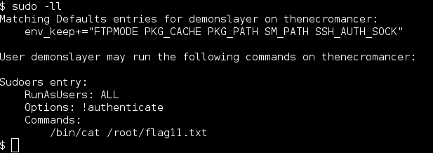

This is the end:
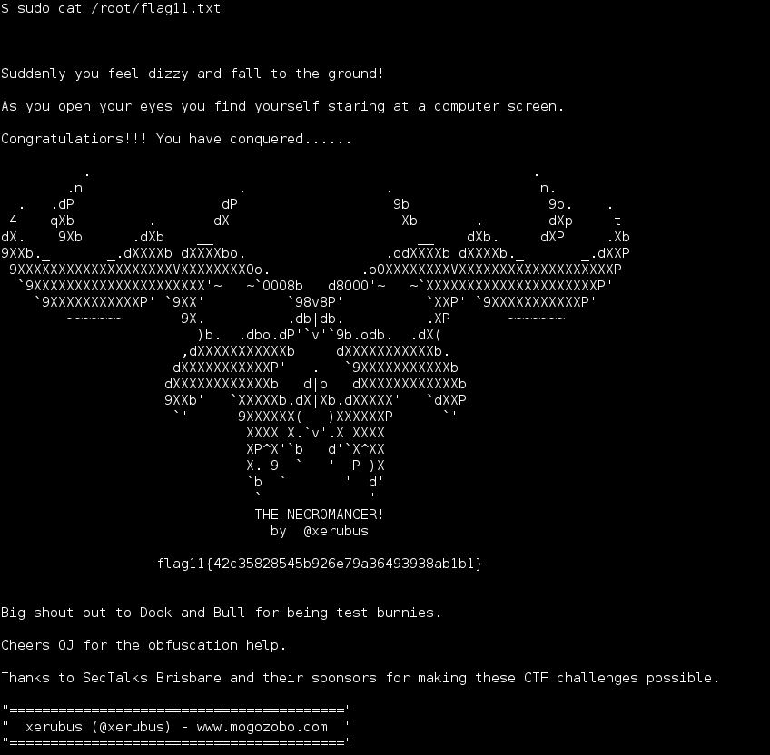

**flag11{42c35828545b926e79a36493938ab1b1}**

This VMs happend to be reall challenge for me and cost me four full days to
complete it. I used help at one of the points where we do directory enumeration 
because dirbuster missed the directory and I didn't run another tool at this
point. After check other walkthroughs manage to find the directory with wfuzz.
Binary file also eat me alive... So at the end I experienced the satisfaction to
complete my first challenge to the end! Good luck everyone and if you read down
to this point thank you for be with me!
